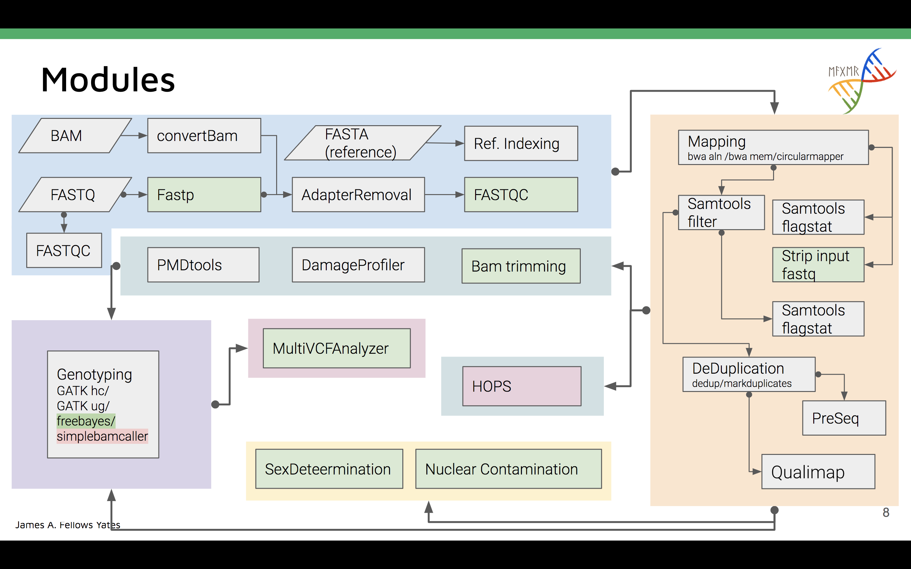
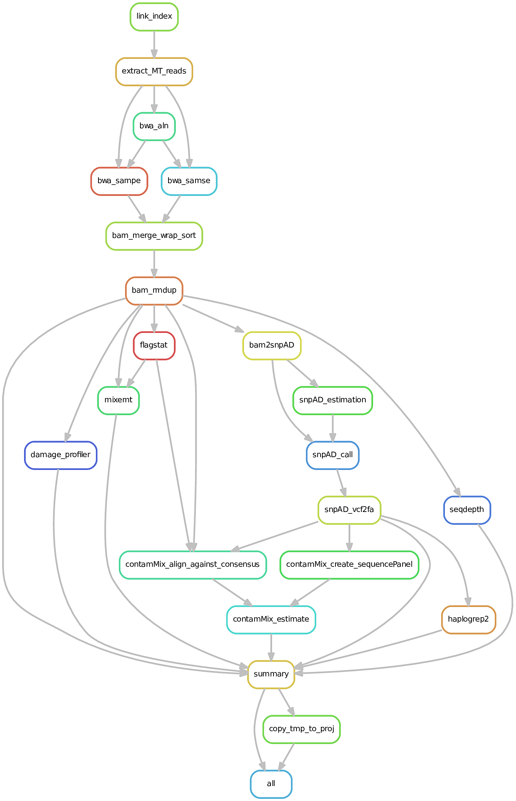

# Computational analysis: a chain of commands

- most common computational analyses are complex: >> 1 step
- if only one or a few steps: **quick and dirty**
- more steps or more samples: **automation wanted**

# Example: Calculate the average coverage at chromosome 21 of the human reference genome

## Set-up

- 3 BAM files with sequencing data aligned against the human reference genome (e.g. output of EAGER)
- samples taken from Meyer M et al. (Science, 2012): A high coverage genome sequence from an archaic
  Denisovan individual.

  + HGDP00521: B_French
  + HGDP00778: B_Han 
  + HGDP01029: B_San

- heavily sub-sampled: in folder "data"

## Goal

- average coverage at chromosome 21 for all of the samples

## Necessary steps per sample:
  
  1. Sort sample by coordinate
  2. Index sample
  3. Subset sample to chromosome 21
  4. Determine coverage along chromosome 21
  5. Calculate average coverage on chromosome 21
  
# Code for a single sample

```{bash, eval = F}
# 1. Use samtools sort to sort reads by co-ordinate;
#    requirement for indexing
samtools sort -o <sample>.sorted.bam <sample>.bam
# 2. Use samtools index to generate index for random read extraction
samtools index <sample>.sorted.bam
# 3. Extract all reads that were aligned to chromosome 21
samtools view -bh <sample>.sorted.bam 21 > <sample>.21.bam
# 4. Calculate the coverage along chromosome 21
samtools depth -a <sample>.21.bam > <sample>.21_depth.txt
# 5. Calculate the average coverage
awk '{sum += $3}END{print sum / NR}' <sample>.21_depth.txt \
> <sample>.21_meancov.txt
```

# How do we deal with multiple samples?

## Worst: copy and paste

  - bad practice
  - use only for

    + small number of samples (rule of thumb: <= 3)
    + will do only a single time

  - problems:

    + modifying code requires a lot of changes
    + code block get redundant => hard to read and debug

## Better: for-loops

  - list samples for which a particular code block should be executed

  - improvements:

    + code modifications only have to be a single time
    + no code redundancy: only two additional lines

## Better: for-loops

  - code example for **for-loop**:

```{bash, eval = F}
for SAMPLE in sample1 sample2 sample3; do
    # 1. Use samtools sort to sort reads by co-ordinate;
    #    requirement for indexing
    samtools sort -o ${SAMPLE}.sorted.bam ${SAMPLE}.bam
    # 2. Use samtools index to generate index for random read extraction
    samtools index ${SAMPLE}.sorted.bam
    # 3. Extract all reads that were aligned to chromosome 21
    samtools view -bh ${SAMPLE}.sorted.bam 21 > ${SAMPLE}.21.bam
    # 4. Calculate the coverage along chromosome 21
    samtools depth -a ${SAMPLE}.21.bam > ${SAMPLE}.21_depth.txt
    # 5. Calculate the average coverage
    awk '{sum += $3}END{print sum / NR}' ${SAMPLE}.21_depth.txt \
    > ${SAMPLE}.21_meancov.txt
done
```
  
## Problems: for-loops

  - not aware of missing data

      + successful samples have to be explicitly exclude to avoid re-processing
      + makes it harder to understand with which commands samples were processed

```{bash, eval=F}
#for SAMPLE in sample1 sample2 sample3; do
for SAMPLE in sample1 sample2; do
    ...
done
```

## Problems: for-loops

  - serial processing on local computer

     + sample2 will only be processed after sample1 was succesfully processed
     + when samples and steps are independent from each other, parallisation has to be done manually

# Real-life worst-case scenario

  We have 100 samples, of which only 15 successfully finished our for-loop:

  1. 60 samples have broken BAM files and we need to run additional steps to fix the
     input format prior to running our for-loop
  2. 25 samles worked, however, they were low-coverage and we forgot to add the option *'-a'* to
     the command *samtools depth* so that our average coverage estimate is wrong
  3. 15 samples worked and were high coverage: correct estimates

## Solutions:

  1. **60 failed samples**: start from the beginning after fixing the input files
  2. **25 samples with wrong average coverage estimate**: re-start from *samtools depth* command
  3. **15 samples that worked**: exclude from input sample list to avoid re-processing

  **instead of 1 for-loop, now 2 for-loops!**

# Workflow management systems

## Workflows or pipelines

  - computational analyses can be defined as a workflow with hierarchical steps

   

  - next to the steps, workflows describe the dependencies from the steps to each other 

## The predecessor: make and the Makefile

  - originally build to maintain the building and compilation process of complex computational
    software
  - syntax is build on defining which input is required and which output is expected

```{bash, eval = F}
<output>: <input>
    command to generate <output> from <input>
```

  - execution: `make -f Makefile`

## How does it work?
  
  - **based on files**
  - **recursive checking** whether required files for the current task are present; if not, go and check the task that
    produces the input file of the current task
  - only run task for a sample when

      + the input file is missing or
      + a file that is an input file to one of the rules that leads to the current task is newer
        than the output file of the current task
      + the code definition of the current task changed

## Example Makefile for "sorting by coordinate" command

   
  
```{bash, eval=F}
sample1.sorted.bam: sample1.hg19.bam
    samtools sort -o $@ $^
```

## Successors of make

  - originally written in the 70s; still used today in software development
  - concept independent of software development: can be used for any kind of commands 
  - however, 

      + scripting language is rather rudimentary
      + lacks common features for data processing, e.g. logging of meta-data
      + not easily scalable to the usage on the cluster
      + does not integrate well with conda

  - adaptation for use in data-driven sciences: e.g. [Nextflow](https://www.nextflow.io/),
    [Snakemake](https://snakemake.readthedocs.io/en/stable/).

## Nextflow vs. Snakemake

  - different concepts regarding how to connect tasks and the underlying language

  1. Nextflow

     + tasks connection: channels (push)
     + language: Groovy

  2. Snakemake

     + tasks connection: filename, similar like make (pull)
     + language: Python

# Snakemake

  - available since 2012:

    <small>Johannes Köster, Sven Rahmann, Snakemake—a scalable bioinformatics
    workflow engine, Bioinformatics, Volume 28, Issue 19, 1 October 2012, Pages 2520–2522,
    https://doi.org/10.1093/bioinformatics/bts480</small>

  - abstract:

    "Snakemake is a workflow engine that provides a readable Python-based workflow definition
    language and a powerful execution environment that scales from single-core workstations to
    compute clusters without modifying the workflow. It is the first system to support the use of
    automatically inferred multiple named wildcards (or variables) in input and output filenames."

## Execution

  - execution scheme very similar to `make`

```{bash, eval = F}
snakemake -s Snakefile [...]
```

  - long list of powerful command-line options; try `snakemake -h`
  - detailed overview over options: [readthedocs Snakemake](https://snakemake.readthedocs.io/en/stable/)

## Rules

  - reminder: rule definition in `make`

```{bash, eval=F}
<output>: <input>
    command
```

  - in `snakemake`:

```{bash, eval=F}
rule <name of the rule>:
    input:
        "<input>"
    output:
        "<output>"
    shell/run:
        command
```

**Attention**: indentation is important - either **Tabs** or a regular number of spaces (e.g. 4 or
8)

## Implementing the first rule

```{bash, eval=F}
rule sort_coord:
    input:
        "{sample}.hg19.bam"
    output:
        "{sample}.sorted.bam"
    shell:
        """
        samtools sort -o {output} {input}
        """
```

## Special case: rule without input requirements

  - recursive iteration through workflow: which output file depends on which input file?
  - by implementation: file listed in **input** has to be the output file of a different rule
  - **non-cyclic workflows**: one rule cannot have a file stated as input

  - solution: if file was generated outside of workflow, state as a rule parameter (**params**)

## Special case: rule without input requirements

```{bash, eval=F}
rule sort_coord:
    output:
        "{sample}.sorted.bam"
    params:
        bam = "{sample}.hg19.bam"
    shell:
        """
        samtools sort -o {output} {params.bam}
        """
```

  - files listed as parameters will not be checked regarding the directionality

## Implementing the second rule

```{bash, eval=F}
rule index_sorted_bam:
    input:
        "{sample}.sorted.bam"
    output:
        "{sample}.sorted.bam.bai"
    shell:
        """
        samtools index {input}
        """
```

  for all but the first rules, the directionality of the workflow is established by stating the
  output of one rule as the input of the subsequent rule

## Providing the list of samples in for-loops

  either explicitly stated: 

```{bash, eval =F}
for i in sample1 sample2 sample3; do
```

  or inferred: 

```{bash, eval =F}
for i in $(ls data/*.hg19.bam); do
```

  - identical in `snakemake` but Python is used as the scripting language

## Providing the list of samples - Snakemake

  either explicitly stated:

```{python, eval=F, python.reticulate=F}
SAMPLES = ['sample1', 'sample2', 'sample3']
```

  or inferred:

```{python, eval=F, python.reticulate=F}
SAMPLES, = glob_wildcards("data/{sample}.hg19.bam")
```

  - `glob_wildcards()`
    + runs a `ls()` command to get the list of files
    + extracts the pattern `{sample}` from the filename (equivalent to `basename`/`sed`)

## The dummy "all" rule

  - `snakemake` infers the expected wildcards and therefore filenames on the fly 
  - the recursive iteration requires that one rule has no **wildcards** in its input statement
  
```{bash, eval=F}
rule all:
    input:
        expand("{sample}.sorted.bam.bai", sample=SAMPLES)
```

  - **dummy rule**: no output
  - function **expand()** generates the list of expected filenames given the filename pattern and
    the list of samples

## Test our workflow

  - save Snakefile
  - execute it in **dry-run** mode: show what you will do, but don't do it

```{bash, eval=F}
snakemake -s test.Snakefile -n -p
```

  - options:
    + `-n`: dry-run mode
    + `-p`: print command plot

## Run the complete workflow

  - prepared in the repository
  - two versions: the efficient one removes a bottleneck of saving a large file unnecessarily to
    file

``{bash, eval=F}
snakemake -s rrdm_workflow_management.efficient.Snakefile -n -p
```


# More advanced snakemake

## Grammar blocks to decorate your rules:

  - four grammar blocks have been introduced so far:
    + input
    + output
    + params
    + shell

  - however, a few more useful ones

## Grammar blocks to decorate your rules:

  - **message**: replace the cryptic Snakemake output with a catchy message that tells you what is
    currently executed and on which sample
  - **log**: provides a fast way to define the filename for saving the log file using wildcards
  - **benchmark**: provides you feedback, how many resources (mainly memory) were used for executing
    a rule

## Grammar blocks to decorate your rules:

  - **resources**: define a custom list of resources in order to restrict the parallel execution of
    resources-hungry jobs
  - **threads**: define the number of CPUs a job needs in order to restrict the parallel execution of
    resources-hungry jobs 
  - **run**: run Python or R code directly instead of a shell script

## Running jobs in parallel

  - rules that do not depend on other samples can be run in parallel for each sample
  - **requirement**: more than one job is allowed at the same time
  - in order to enable more jobs use option `-j` or `--jobs`:

```{bash, eval = F}
snakemake -s test.Snakefile -j 3
```

  - on a local computer, jobs are restricted by the number of **threads** defined in a rule

## Running jobs on the cluster

  - no change to code necessary, just provide commandline option `--cluster` and your parameters for
    the scheduler, e.g. SLURM

```{bash, eval = F}
snakemake -s test.Snakefile \
    --cluster "sbatch --mem 8G -p short -t 0-2:00" -j 3
```

  - specify different resource requirements (memory, partition, time) for individual rules using the
    option `--cluster-config` and a JSON file

## Cleaning intermediate files

  - wrap **temp()** around filename of the output rule to have automatically removed as an
    intermediate file when all rules that depend on it have successfully finished

```{bash, eval = F}
rule sort_coord:
    output:
        temp("{sample}.sorted.bam")
    params:
        bam = "{sample}.hg19.bam"
    shell:
        """
        samtools sort -o {output} {params.bam}
        """
```

  - opposite: **protected()** - do not delete ever

## Overview over all rule options

  [Rules](https://snakemake.readthedocs.io/en/stable/snakefiles/rules.html)

# Conclusion

  - the scripting language provides tools for running computational analyses, but has short-comings
    when dealing with complex workflows
  - multiple workflow management systems available: Snakemake, Nextflow, make

# Conclusion

  - major advantages:

      + higher research efficiency: run only necessary jobs; execute jobs in parallel; job-specific
        resources
      + implementation identical for execution locally or on cluster  
      + formal scaffold of building rules: higher readability of code
      + automatic logging of execution
      + provides tools to automatically clean the temporary files

# Examples

## EAGER2 (Nextflow)



https://nf-co.re/eager

## mitoBench ancient mtDNA pipeline (Snakemake)

```{r, out.height="450px", out.width="400px", echo = F}

```

http://github.com/alexhbnr/mitoBench-ancientMT

## Running mitoBench ancient mtDNA pipeline

```{bash, eval = F}
snakemake -s mitoBench_pipeline.Snakefile \
          --configfile mitoBench_pipeline-config.json \
          --cluster-config mitoBench_pipeline-SLURM.json \
          --cluster 'sbatch --mem {cluster.mem} -p {cluster.partition} \
                    -t {cluster.time} -o {cluster.out} \
                    -e {cluster.err} -n {threads}' \
          --use-conda \
          --local-cores 8 \
          --cores 20
```

